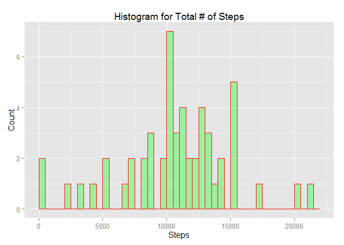
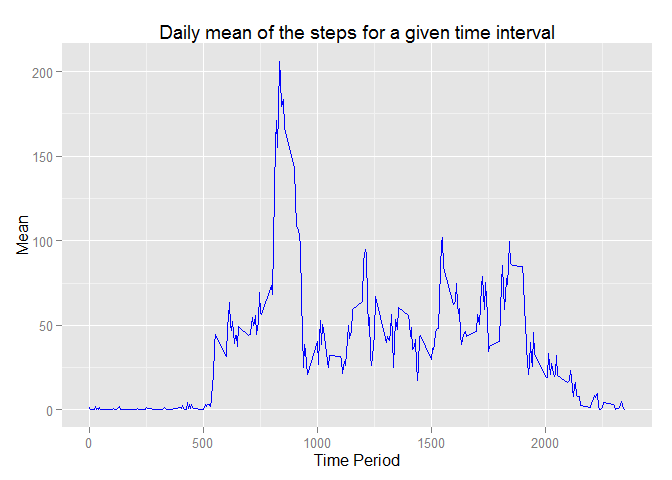
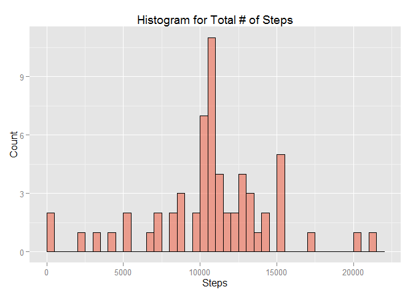
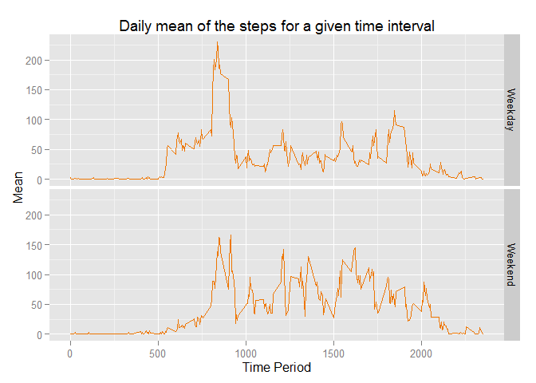

# Assignment_1
Dheeraj Agarwal  
October 14, 2015  
  
# Scope: 
Write a report (using a single R Markdown file) that can be processed by knitr and be transformed into an HTML file. The report must answers the questions detailed below

##Note: 
1. Always use **echo = TRUE**  
2. The plots are based on either **base** or **ggplot2** 
3. The R working directory is not same as the RMD working directory. Hence the source data must be in the folder where RMD file is saved.
4. Don't forget to run ***knit2html("PA1_template.RMD")*** in the console to generate a markdown file.

## Source: 
[Activity Monitoring Data](https://d396qusza40orc.cloudfront.net/repdata%2Fdata%2Factivity.zip)  

***  
###Question1:
Loading the data and preprocess if necessary) into a format suitable for analysis. Ignore missing values for this question.  

###Question2:
What is mean total number of steps taken per day? Make a histogram. Report the mean and median.  

###Question3:  
* What is the average daily activity pattern? Answer using a time series plot of the 5 min interval and the average number of steps taken, averaged across all days (y-axis).  
* Which 5-minute interval, on average across all the days in the dataset, contains the maximum number of steps?

###Question4:  
* Calculate and report the total number of missing values in the dataset.  
* Devise a strategy for filling in all of the missing values in the dataset. The strategy does not need to be sophisticated. For example, you could use the mean/median for that day, or the mean for that 5-minute interval, etc.  
* Create a new dataset that is equal to the original dataset but with the missing data filled in.  
* Make a histogram of the total number of steps taken each day and Calculate and report the mean and median total number of steps taken per day. Do these values differ from the estimates from the first part of the assignment? What is the impact of imputing missing data on the estimates of the total daily number of steps?  

###Question5:  
* Are there differences in activity patterns between weekdays and weekends?  
* Create a new factor variable in the dataset with two levels – “weekday” and “weekend” indicating whether a given date is a weekday or weekend day.  
* Make a panel plot containing a time series plot (i.e. type = "l") of the 5-minute interval (x-axis) and the average number of steps taken, averaged across all weekday days or weekend days (y-axis). See the README file in the GitHub repository to see an example of what this plot should look like using simulated data.  

***
### *Global Settings*

```r
knitr::opts_chunk$set(echo = TRUE, options(scipen=999))
```

### *Answer to question 1*

```r
# The section assumes that the sourcedata is downloaded, unzipped and available in the folder where the RMD file exists.
input <- read.csv("./activity.csv", header = TRUE)
# Displaying the first 3 rows of the original data set as a sample
head(input,3)
```

```
##   steps       date interval
## 1    NA 2012-10-01        0
## 2    NA 2012-10-01        5
## 3    NA 2012-10-01       10
```

```r
# Pre-Processing Data for various use cases
        # Data for Question 2
input2 <- na.omit(input)
steps_sum <- aggregate(input2$steps, list(date  = input2$date), sum)
        
        # Data for Question 3
library(plyr)
steps_ave <- ddply(input2, ~interval, summarise, mean = mean(steps), sum = sum(steps))
```

### *Answer to question 2*

```r
library(ggplot2)
# Creating histogram with bins of width 500
ggplot(data = steps_sum, aes(steps_sum$x))+
        geom_histogram(breaks = seq(0,22000, by =500), col = "red", fill = "green", alpha = 0.3) +
        labs(title = "Histogram for Total # of Steps", x = "Steps", y = "Count")
```

 

The above distribution has the ***mean*** of (rounded to 2 digits)  **10766.19** and ***median*** of **10765**.

### *Answer to question 3*

```r
ggplot(data = steps_ave, aes(steps_ave$interval, steps_ave$mean, group =1)) +
        geom_line(col="blue") +
        labs(title = "Daily mean of the steps for a given time interval", x = "Time Period", y = "Mean")
```

 

The **835^th^** 5 minute time slot has the maximum average.

### *Answer to question 4*
The total number of missing values i.e. values with **NA** is ***2304***  


```r
# For any given day, the central tendency varies by quite a bit. To impute, the logic used is
        # To replace the NA with the average of that 5 minute interval across all days
        # Round it to nearest integer. 
input3 <- merge(input,steps_ave)
input3$steps[is.na(input3$steps)] <- input3$mean[is.na(input3$steps)]
input3$steps <- round(input3$steps)
# Displaying the first 3 rows of the imputed data set as a sample
head(input3,3)
```

```
##   interval steps       date     mean sum
## 1        0     2 2012-10-01 1.716981  91
## 2        0     0 2012-11-23 1.716981  91
## 3        0     0 2012-10-28 1.716981  91
```

```r
# Displaying the histogram similar to question 2
steps_sum2 <- aggregate(input3$steps, list(date  = input3$date), sum)

ggplot(data = steps_sum2, aes(steps_sum2$x))+
        geom_histogram(breaks = seq(0,22000, by =500), col = "black", fill = "coral2", alpha = 0.6) +
        labs(title = "Histogram for Total # of Steps", x = "Steps", y = "Count")
```

 

The above distribution has the ***mean*** of (rounded to 2 digits)  **10765.64** and ***median*** of **10762**.   
It can be noticed that using the above mentioned logic for imputing has caused both the ***mean*** and the ***median*** to decrease slightly. Since the airthmetic mean has fallen, the average steps taken across all days is lower than what it were if the **NA's** were ignored.  

### *Answer to question 5*  
This section uses the imputed data in the previous step, hence the results might be different if the original data set was used in stead.  


```r
input4 <- input3[,1:3]
input4$day <- weekdays(as.Date(input4$date, format = "%Y-%m-%d"))

# Creating a weekday / weekend column based on the day of the week
weekend <- c("Saturday", "Sunday")
for (i in 1:dim(input4)[1]){
        if (input4$day[i] %in% weekend){
                input4$day_type[i] <- "Weekend"
        } else {
                input4$day_type[i] <- "Weekday"
        }
}
input4$day_type <- as.factor(input4$day_type)
input4 <- input4[,-c(3:4)]

# Calculating averages across 5 minutes intervals
steps_ave2 <- aggregate(.~day_type+interval,data=input4, FUN = mean)

# Plotting the timeseries
ggplot(data = steps_ave2, aes(interval, steps)) + 
        geom_line(col="darkorange2") +
        labs(title = "Daily mean of the steps for a given time interval", x = "Time Period", y = "Mean") +
        facet_grid(day_type ~ .)
```

 

Based on the above distribution, it can be infered that the average number of steps varied considerably across weekdays vs weekends. During weekdays, the data collection was towards the first half with a very clear peak. During weekends it was relatively more evenly distributed.

***  
###Data Legends:  
Object Name | Object Value
----------- | -------------
input       | Original data
input2      | Non-NA entries of original data
input3      | Imputed values of steps for NAs
input4      | Filtered input3 without date and day
steps_ave   | Daily average across all days per time slot
steps_ave2  | Daily average across weekday/weekends per time slot
steps_sum   | Daily totals across all time slots (based on input2) 
steps_sum2  | Daily totals across all time slots (based on input3)  

***  
DISCLAIMER: This concludes my report based on my understanding of the problem statements. This report was created as part of Coursera Data Science Specialization::Reproducible Research course starting Oct 5th 2015. Please feel free to use it as a reference, however if you are taking the course yourself, please do not copy it.
