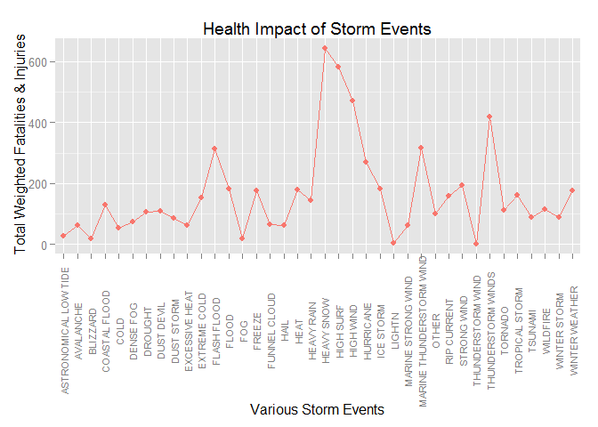
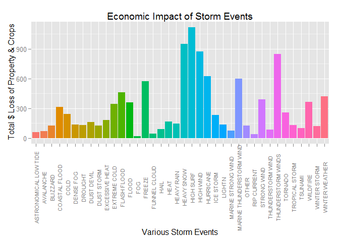

# Storm events & their economic and health impact.
Dheeraj Agarwal  
October 17, 2015  

# Synopsis:
The data from the below metioned sources contains the various storm events recorded by NWS over several years. Since the data collection spans several field offices across decades, it was documented inconsistently. To analyse the data from a socio-economic perspective, it was filtered down for relevant information and then the various storm events were grouped together after transforming to consistent names. The property and crop damages were simply added after applying the exponents, however for health data, a weight total was calculated. Based on the final output, it is easy to the impact of various events visually. It can be noticed that ***Heavy Snow*** has the most impact on health and ***High Surf*** was the cause of the greatest economic damage across US for the data collection period.

### Source(s): 
[Storm Data](https://d396qusza40orc.cloudfront.net/repdata%2Fdata%2FStormData.csv.bz2)  
[Storm Data Documentation](https://d396qusza40orc.cloudfront.net/repdata%2Fpeer2_doc%2Fpd01016005curr.pdf)

***  
### **Question1:**
Across the United States, which types of events (as indicated in the EVTYPE variable) are most harmful with respect to population health? 

### **Question2:**
Across the United States, which types of events have the greatest economic consequences?  

***
## DATA PROCESSING
___________________________________________

### *Global Settings*  
The below global setting allow the code to be visible and switches the scientific notation of large numbers off.  

```r
knitr::opts_chunk$set(echo = TRUE, options(scipen=999))
```

### *Data Prep*
The entire data tidying has been divided into multiple chuncks for easy troubleshooting and reading. It is assumed that the data is downloaded and available in the folder where this .rmd file is housed.  

#### **Section 1:** Data Download & Basic Summary

```r
# The data for this analysis was downloaded on Oct 12th 2015.
raw <- read.csv("./Storm Data.bz2", header = TRUE)
```
  
Below is a very quick summary of some of the key attributes pertinent to the problem:  

```r
dimensions <- dim(raw)
class <- class(raw$EVTYPE)
```

The data set has **902297** rows and **37** columns. The event type is a **factor**.  
The data column names in the original data are presented below:  

```r
names(raw)
```

```
##  [1] "STATE__"    "BGN_DATE"   "BGN_TIME"   "TIME_ZONE"  "COUNTY"    
##  [6] "COUNTYNAME" "STATE"      "EVTYPE"     "BGN_RANGE"  "BGN_AZI"   
## [11] "BGN_LOCATI" "END_DATE"   "END_TIME"   "COUNTY_END" "COUNTYENDN"
## [16] "END_RANGE"  "END_AZI"    "END_LOCATI" "LENGTH"     "WIDTH"     
## [21] "F"          "MAG"        "FATALITIES" "INJURIES"   "PROPDMG"   
## [26] "PROPDMGEXP" "CROPDMG"    "CROPDMGEXP" "WFO"        "STATEOFFIC"
## [31] "ZONENAMES"  "LATITUDE"   "LONGITUDE"  "LATITUDE_E" "LONGITUDE_"
## [36] "REMARKS"    "REFNUM"
```

#### **Section 2:** Health & Porperty Transformation    
Given the column names and the objective of this report, only pertinent data is retained. Since the questions specifically ask about the health and economic damage of storm events, all fields that do not directly pertain to these are being removed for subsequent analysis.

The following code will try to bring consistency in data values. Replace character exponents with their numerical counterpart and remove unnecessary values (Summary rows only) from the Storm events(EVTYPE).


```r
input <- raw[c(8, 23:28, 36)]
names(input)
```

```
## [1] "EVTYPE"     "FATALITIES" "INJURIES"   "PROPDMG"    "PROPDMGEXP"
## [6] "CROPDMG"    "CROPDMGEXP" "REMARKS"
```

**Property & Crop Exponent Definition:**  
Based on remarks for ***+***, the exp assigned is 5 which is equivalent to a multiplier of 100,000, ***?*** is assumed as 0 because the property damage is reported as 0 in all related instances even though the remarks indicate some damage. ***-*** has been taken as 4 again based on the remarks and the analysts estimate of likely damage.

Similarly for crop damages the values of exponents are determined to be consistent with property damages.

```r
suppressMessages(library(plyr)) 
# Prop Exponent
newvalues <- c("?"="0", "H"="2", "h"="2", "K"="3", "-"="4", "+"="5", "m"="6", "M"="6", "B"="9")
input$PROPDMGEXP <-  revalue(input$PROPDMGEXP, newvalues)
input$PROPDMGEXP <- as.numeric(as.character(input$PROPDMGEXP))
# Crop Exponent
newvalues <- c("?"="0", "K"="3", "k"="3", "m"="6", "M"="6", "B"="9")
input$CROPDMGEXP <-  revalue(input$CROPDMGEXP, newvalues)
input$CROPDMGEXP <- as.numeric(as.character(input$CROPDMGEXP))
```

#### **Section 3:** Clean Summary Stats from Events  
Removing all **EVTYPES** that have the word *summary*. This is done because in all cases where **EVTYPE** has the word *summary*, the values are 0 for all 4 measured fields i.e. fatalities, injuries, prop damage and crop damage.

```r
fout <- grep("Summary|SUMMARY",input$EVTYPE, value = FALSE)
input2 <- input[-fout,] 
```

#### **Section 4:** Impute values for NA  
The logic has been kept simple, the mean of property and crop exponents is calculated and then rounded to the *nearest integer*. This value has then be used to replace NAs.

```r
idx1 <- is.na(input2$PROPDMGEXP); idx2 <- is.na(input2$CROPDMGEXP)
temp <- input2[!idx1,]
mean1 <- round(mean(temp$PROPDMGEXP))
temp <- input2[!idx2,]
mean2 <- round(mean(temp$CROPDMGEXP))
input2[is.na(input2)] <- mean1
```
The mean of the property damage exponent and crops damage exponent is ***3*** & ***3*** respectively. Since the mean values are same, the NAs have been replaced with ***3***.  

#### **Section 5:** Health and Economic Damage Calculations  
The total health impact is treated to be 1 times the fatalities and 2 times the injuries. Injuries have been weighted more keeping urgency as well as pressure on existing resources in mind. Economic impact for each record is calculated as the sum of  the total property and crop damage after multiplying the damage numbers with the respective exponents. Once the calculations are done, the original data will be removed for better readability.

```r
# Health impact
input2$HealthImpact <- input2$FATALITIES*1+input2$INJURIES*2
# Economic impact
input2$PropImpact <- input2$PROPDMG*10^input2$PROPDMGEXP
input2$CropImpact <- input2$CROPDMG*10^input2$CROPDMGEXP
input2$EconImpact <- input2$PropImpact + input2$CropImpact
input3 <- input2[c(1, 9, 12)]
```

The transformed data set now has the following columns:  
**EVTYPE, HealthImpact, EconImpact**.  

#### **Section 6:** Storm Events Definition
EVETYPE was inconsistently documented due to manual entries. After an initial aggregation, the event types would be transformed based on information available in the [STORM DATA DOCUMENT](https://d396qusza40orc.cloudfront.net/repdata%2Fpeer2_doc%2Fpd01016005curr.pdf). These two activities (even type transformation and aggregation) would be performed iteratively until a final consistent data set is available.  

Any values that are zero for both health and economic index will be dropped. All names will be converted to capital case for consistency.  

```r
input4 <- ddply(input3,~EVTYPE,summarise,SumHealth=sum(as.numeric(HealthImpact)),SumEcon=sum(as.numeric(EconImpact)))
# Retaining values that not both zeroes.
input5 <- subset(input4, input4$SumHealth!=0 & input4$SumEcon!=0)
# Converting all names to capital case.
input5 <- as.data.frame(sapply(input5, toupper))
input5$EVTYPE <- as.character(input5$EVTYPE)
# Series of substitutions to remove special characters and numbers from types
input5$EVTYPE <- gsub("\\d", "", input5$EVTYPE)
input5$EVTYPE <- gsub("ING", "", input5$EVTYPE)
input5$EVTYPE <- gsub("/.*", "", input5$EVTYPE)
input5$EVTYPE <- gsub("\\(.*", "", input5$EVTYPE)
input5$EVTYPE <- gsub("\\&.*", "", input5$EVTYPE)
# Series of substitutions to make terms singular and consistent with events types from documentation
input5$EVTYPE <- gsub("FLOODS", "FLOOD", input5$EVTYPE)
input5$EVTYPE <- gsub("WINDS.*", "WIND", input5$EVTYPE)
input5$EVTYPE <- gsub("STORMS", "STORM", input5$EVTYPE)
input5$EVTYPE <- gsub("RAINS", "RAIN", input5$EVTYPE)
# Series of transformation to name events consistently and correct any spellings and colloquial usage.
input5$EVTYPE <- gsub("HURRICANE.*", "HURRICANE", input5$EVTYPE)
input5$EVTYPE <- gsub(".*SNOW.*", "HEAVY SNOW", input5$EVTYPE)
input5$EVTYPE <- gsub("EXTENDED", "EXTREME", input5$EVTYPE)
input5$EVTYPE <- gsub("FREEZ.*", "FREEZE", input5$EVTYPE)
input5$EVTYPE <- gsub("FROST.*", "FREEZE", input5$EVTYPE)
input5$EVTYPE <- gsub(".*FIRE.*", "WILDFIRE", input5$EVTYPE)
input5$EVTYPE <- gsub(".*COASTAL.*", "COASTAL FLOOD", input5$EVTYPE)
input5$EVTYPE <- gsub(".*MICRO.*", "THUNDERSTORM WINDS", input5$EVTYPE)
input5$EVTYPE <- gsub("EXTREME HEAT", "EXCESSIVE HEAT", input5$EVTYPE)
input5$EVTYPE <- gsub("^GLAZE.*", "WINTER WEATHER", input5$EVTYPE)
input5$EVTYPE <- gsub("WINDCHILL", "COLD", input5$EVTYPE)
input5$EVTYPE <- gsub(".*SWELL.*", "HIGH SURF", input5$EVTYPE)
input5$EVTYPE <- gsub(".*SEA.*", "HIGH SURF", input5$EVTYPE)
input5$EVTYPE <- gsub(".*ROADS.*", "ICE STORM", input5$EVTYPE)
input5$EVTYPE <- gsub(".*WATER.*", "HIGH SURF", input5$EVTYPE)
input5$EVTYPE <- gsub(".*GUSTY.*", "HIGH WIND", input5$EVTYPE)
input5$EVTYPE <- gsub("RECORD", "EXTREME", input5$EVTYPE)
input5$EVTYPE <- gsub(".*LAND.*", "TSUNAMI", input5$EVTYPE)
input5$EVTYPE <- gsub(".*MINOR.*", "FLASH FLOOD", input5$EVTYPE)
input5$EVTYPE <- gsub(".*RIVER.*", "FLASH FLOOD", input5$EVTYPE)
input5$EVTYPE <- gsub(".*SEVERE.*", "THUNDERSTORM WIND", input5$EVTYPE)
input5$EVTYPE <- gsub("^SMALL", "", input5$EVTYPE)
input5$EVTYPE <- gsub(".*SURGE.*", "FLOOD", input5$EVTYPE)
# Second level aggregation
input6 <- ddply(input5,~EVTYPE,summarise,SumHealth1=sum(as.numeric(SumHealth)),SumEcon1=sum(as.numeric(SumEcon)))
# Series of transformation to make the terms consistent by dropping any leading or trailing characters like spaces. This also completes the names if only a partial name was used.
input6$EVTYPE <- gsub("^HEAT.+", "HEAT", input6$EVTYPE)
input6$EVTYPE <- gsub("^FLOOD.*", "FLOOD", input6$EVTYPE)
input6$EVTYPE <- gsub(".*SURF.*", "HIGH SURF", input6$EVTYPE)
input6$EVTYPE <- gsub(".*ICE.*", "ICE STORM", input6$EVTYPE)
input6$EVTYPE <- gsub(".*RIP.*", "RIP CURRENT", input6$EVTYPE)
# Third level of aggregation
input7 <- ddply(input6,~EVTYPE,summarise,SumHealth=sum(SumHealth1),SumEcon=sum(SumEcon1))
# Series of transformation to make the names usage consistent based on events defined.
input7$EVTYPE <- gsub(".*TSTM.*", "MARINE THUNDERSTORM WIND", input7$EVTYPE)
input7$EVTYPE <- gsub(".*ACC.*", "MARINE THUNDERSTORM WIND", input7$EVTYPE)
input7$EVTYPE <- gsub(".*HAIL.*", "HAIL", input7$EVTYPE)
input7$EVTYPE <- gsub(".*HIGH WIND.*", "HIGH WIND", input7$EVTYPE)
input7$EVTYPE <- gsub("^THUNDER.*", "THUNDERSTORM WINDS", input7$EVTYPE)
# Forth level fo aggregation
input8 <- ddply(input7,~EVTYPE,summarise,SumHealth1=sum(SumHealth),SumEcon1=sum(SumEcon))
# Final series of even type transformations
input8$EVTYPE <- gsub(".*TID.*", "ASTRONOMICAL LOW TIDE", input8$EVTYPE)
input8$EVTYPE <- gsub("^TORNA.*", "TORNADO", input8$EVTYPE)
input8$EVTYPE <- gsub("^TROPI.*", "TROPICAL STORM", input8$EVTYPE)
input8$EVTYPE <- gsub("^TYP.*", "HURRICANE", input8$EVTYPE)
input8$EVTYPE <- gsub(".*WHIRL.*", "THUNDERSTORM WIND", input8$EVTYPE)
input8$EVTYPE <- gsub(".*WILD.*", "WILDFIRE", input8$EVTYPE)
input8$EVTYPE <- gsub("^WIND.*", "STRONG WIND", input8$EVTYPE)
input8$EVTYPE <- gsub(".*WEATH.*", "WINTER WEATHER", input8$EVTYPE)
input8$EVTYPE <- gsub(".*MIX.*", "WINTER WEATHER", input8$EVTYPE)
input8$EVTYPE <- gsub(".*URBAN.*", "OTHER", input8$EVTYPE)
# Final output
output <- ddply(input8,~EVTYPE,summarise,SumHealth=sum(SumHealth1),SumEcon=sum(SumEcon1))
```
The above output has ***38*** rows and ***3*** columns. The names of the variables are:
***EVTYPE, SumHealth, SumEcon***.  

***  
## **RESULTS**  
___________________________________________

#### **Health Impact Graph**
***

```r
library(ggplot2)
#plot 1
idx <- grep(max(output$SumHealth),output$SumHealth)
qplot(x=EVTYPE, y=SumHealth, data = output, colour = "blue", group = 1) + 
        ylab(" Total Weighted Fatalities & Injuries") + 
        xlab("Various Storm Events") + 
        ggtitle("Health Impact of Storm Events") + 
        theme(axis.text.x  = element_text(angle=90, vjust=0.5, size=8)) + 
        theme(legend.position="none") + 
        geom_line()
```

 

### **Economic Impact Graph**
***

```r
ggplot(data=output,aes(x=EVTYPE, y=SumEcon, fill = EVTYPE)) +          geom_bar(stat="identity") + 
        theme(axis.text.x  = element_text(angle=90, vjust=0.5, size=8)) + 
        theme(legend.position="none") + 
        ylab(" Total $ Loss of Property & Crops") + 
        xlab("Various Storm Events") + 
        ggtitle("Economic Impact of Storm Events")
```

 

The above graphs demonstrate the impact of various events. The below section will help define the top 3 events for each category i.e. health and economy.

```r
n <- 3
idx1 <- order(output$SumHealth, decreasing = TRUE)[1:n]
idx2 <- order(output$SumEcon, decreasing = TRUE)[1:n]
```
The top 3 events that caused most health damage are ***HEAVY SNOW, HIGH SURF, HIGH WIND*** respectively and the top 3 events that caused most economic damage are ***HIGH SURF, HEAVY SNOW, HIGH WIND*** respectively.  
On careful obervation, it can also be noticed that the top 3 events across health and economy category are the same.  

***  
DISCLAIMER: This concludes my report based on my understanding of the problem statements. This report was created as part of Coursera Data Science Specialization::Reproducible Research course starting Oct 5th 2015. Please feel free to use it as a reference, however if you are taking the course yourself, please do not copy it.
