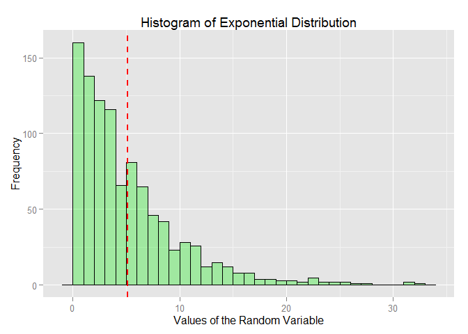
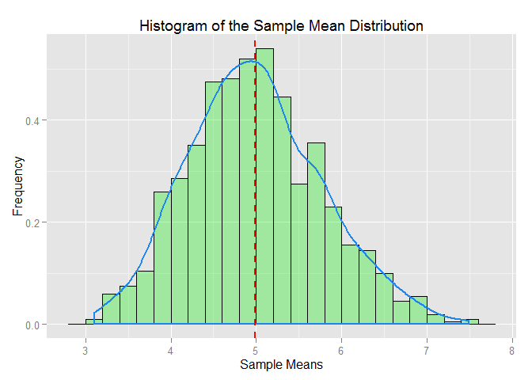

# JHU Coursera: Statistical Inference Assignment1_1: 
Dheeraj Agarwal  
October 21, 2015  

# SCOPE:  
Illustrate via simulation and associated explanatory text the properties of the distribution of the mean of 40 exponentials.  You should:  
1. Show the sample mean and compare it to the theoretical mean of the distribution.  
2. Show how variable the sample is (via variance) and compare it to the theoretical variance of the distribution.  
3. Show that the distribution is approximately normal.  

In point 3, focus on the difference between the distribution of a large collection of random exponentials and the distribution of a large collection of averages of 40 exponentials. 

***  
#### *Global Settings*  
The below global setting allow the code to be visible and switches the scientific notation of large numbers off.  

```r
knitr::opts_chunk$set(echo = TRUE, options(scipen=999))
library(ggplot2)
```
***  
## **PART 1: SIMULATION**  
___________________________________________  

The below section defines the exponential distribution of a random variable and will be the basis for theorical parameters like variance, standard deviation and mean.  

```r
set.seed(1)
N <- 1000 # num of simulations
lambda <- 0.2 # rate parameter
p_dist <- rexp(N, lambda)
n <- 40 # sample size
sm <- NULL # sample mean
for (i in 1 : 1000) sm = c(sm, mean(rexp(n, lambda)))
```

## **PART 2: DISTRIBUTION PLOTS**  
___________________________________________  

The below section defines the sample of exponential distribution of a random variable (as defined above) and will be the basis for actual parameters like variance, standard deviation and mean. It plots the data and also depicts the mean for this distribution.  

```r
# Plotting the original distribution.
ggplot(data = as.data.frame(p_dist), aes(p_dist)) +
        geom_histogram(
                binwidth = 1, 
                col = "black", 
                fill = "green2", 
                alpha = 0.3
        ) +
        labs(
                title = "Histogram of Exponential Distribution", 
                x = "Values of the Random Variable", 
                y = "Frequency"
        ) + 
        geom_vline(
                aes(xintercept=mean(p_dist)), 
                color="red", 
                linetype="dashed", size=1
        )
```

 

```r
# Plotting sample means
ggplot(data = as.data.frame(sm), aes(sm)) + 
        geom_histogram(
                aes(y=..density..), 
                binwidth = .2, 
                col = "black", 
                fill = "green2", 
                alpha = 0.3
        ) +
        labs(
                title = "Histogram of the Sample Mean Distribution", 
                x = "Sample Means", 
                y = "Frequency"
        ) + 
        geom_density(
                colour = "dodgerblue2", 
                size = 1, alpha = 0.3
        ) + 
        geom_vline(
                aes(xintercept=mean(sm)), 
                color="red", 
                linetype="dashed", size=1
        )
```

 

## **PART 3: CALCULATIONS**  
___________________________________________  

Calculating the theoritical and actual values of the distribution characteristics.  

```r
mean_theo <- round(1/lambda,4) # characteristic of an expo. distributon
mean_actual <- round(mean(sm),4) # actual mean from the sample mean dist.
var_theo <- round(mean_theo^2/n,4) # Variance = (1/lambda)^2/n
var_actual <- round(var(sm),4)
sd_theo <- round(sqrt(var_theo),4) # Std dev = (1/lambda)/sqrt(n)
sd_actual <- round(sd(sm),4)
```

The theoritocal and actual values are summarized as below:  

**Measure**           | **Theoritical Value**  | **Actual Value**
---------------       | ---------------------- | --------------
*Mean*                | 5          | 4.9889
*Standard Deviation*  | 0.7906            | 0.7822
*Variance*            | 0.625           | 0.6119

## **PART 4: OBSERVATIONS**  
___________________________________________  

From the comparison of theoritical and actual values, it can be easily seen that the actual values (calculated from the distribution of sample means) is in ***close approximation*** to the values derived from the population.  

Apart from the demonstrating the CLT here, we can also infer something from the graph. As shows, the above graph along with the histogram of sample means, also plots the density function. By observation, it can be told that the sample mean of an exponential distribution is ***bell shaped curve*** and hence tends to a normal distribution.  

***  
DISCLAIMER: This concludes my report based on my understanding of the problem statements. This report was created as part of Coursera Data Science Specialization::Reproducible Research course starting Oct 5th 2015. Please feel free to use it as a reference, however if you are taking the course yourself, please do not copy it.
